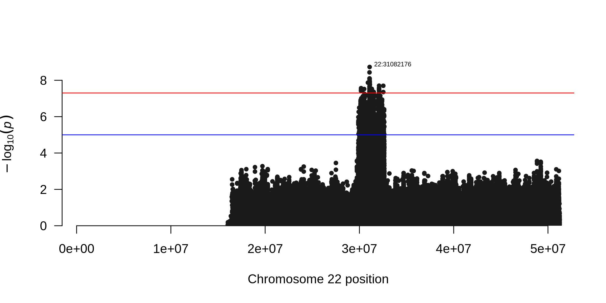

# imputation-tools
A set of tools to impute high throughput genotyping data. Data in [plink binary format](https://www.cog-genomics.org/plink/1.9/formats#bed) is expected as input. *imputation-tools* will:
1. Split the data by chromosomes
2. Align the data according to reference strand using [bcftools fixref](https://samtools.github.io/bcftools/howtos/plugin.fixref.html)
3. Phase the data with [Eagle2](https://data.broadinstitute.org/alkesgroup/Eagle/) and impute the data using [Minimac3](https://genome.sph.umich.edu/wiki/Minimac3) using [1000 genomes reference panel](https://data.broadinstitute.org/alkesgroup/Eagle/#x1-300005.3)
4. Perform standard association test with [plink2 --glm](https://www.cog-genomics.org/plink/2.0/assoc#glm)
5. Visualize the GWAS results using [qqman](https://cran.r-project.org/web/packages/qqman/index.html)

## Installation
*imputation-tools* was tested on Ubuntu 18.04.4 LTS. The running time for chromosome 22 of the included test data takes approximately 90 minutes (2.50GHz CPU, 1 thread). *imputation-tools* requires packages that can be installed using conda ([Miniconda 3](https://docs.conda.io/en/latest/miniconda.html) should be sufficient).

Clone repoitory, unpack files, install environment and required packages, activate environment:
```
git clone https://github.com/oborisov/imputation-tools.git  
cd imputation-tools
gunzip data/* app/*
conda env create --file environment.yml  
conda activate imputation-tools
```

## Running
```
snakemake --config chromosome=22 --config bfile=data/sim1_GSA --config BCFTOOLS_PLUGINS=$(which bcftools | sed 's/bin\/bcftools/libexec\/bcftools/')
```
While running *imputation-tools* will download required files for QC and imputation:
1. [fasta file](http://hgdownload.cse.ucsc.edu/goldenpath/hg19/chromosomes/) for the analyzed chromosome to align the data according to reference strand  
2. [reference vcf file](ftp://ftp.1000genomes.ebi.ac.uk/vol1/ftp/release/20130502/) to phase and impute the analyzed chromosome  

Significant associations were simulated for the test data (`data/sim1_GSA`) at the chromosome 22:  


### Available options
The following options can be passed to the *imputation-tools*:  
chromosome: ```--config chromosome=22```  
path to [binary plink file](https://samtools.github.io/bcftools/howtos/plugin.fixref.html) prefix: ```--config bfile=data/sim1_GSA```  
path to [BCFTOOLS_PLUGINS](https://samtools.github.io/bcftools/howtos/plugins.html), should be determined automatically based on the bcftools installation via conda: ```--config BCFTOOLS_PLUGINS=$(which bcftools | sed 's/bin\/bcftools/libexec\/bcftools/')```  

### used software
snakemake: ```snakemake.readthedocs.io/```  
plink2: ```https://www.cog-genomics.org/plink/2.0/```  
bcftools: ```http://samtools.github.io/bcftools/bcftools.html```  
samtools: ```http://samtools.github.io/```  
tabix: ```http://www.htslib.org/doc/tabix.html```  
Eagle2: ```https://data.broadinstitute.org/alkesgroup/Eagle/```  
Minimac3: ```https://genome.sph.umich.edu/wiki/Minimac3```  


## Docker (under development)
pull latest version of container: ```docker pull olegborisov/imputation-tools:latest```  
run application: ```docker run olegborisov/imputation-tools conda run -n snakemake snakemake```
